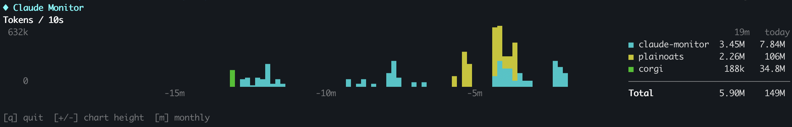
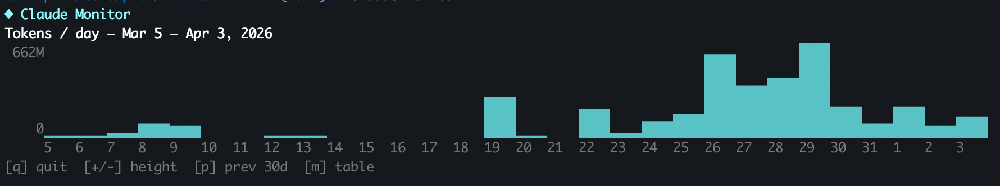
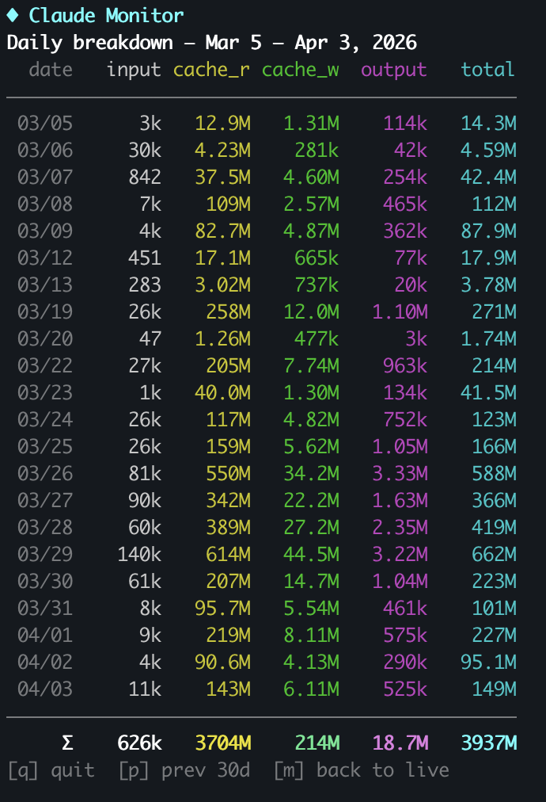

# Claude Monitor

Live terminal dashboard for [Claude Code](https://docs.anthropic.com/en/docs/claude-code) token usage.

Reads local `~/.claude/projects/**/*.jsonl` logs and displays a real-time stacked bar chart of token consumption, broken down by project directory.





## Install

```
pip install claude-monitor
```

Or with [pipx](https://pipx.pypa.io/) for an isolated install:

```
pipx install claude-monitor
```

## Usage

```
claude-monitor
```

### Keyboard shortcuts

| Key | Action |
|-----|--------|
| `q` / `Ctrl+C` | Quit |
| `+` / `-` | Increase / decrease chart height |
| `m` | Cycle views: live chart → monthly chart → daily table |
| `p` / `n` | Previous / next 30-day page (monthly views) |

## Requirements

- **macOS or Linux** (uses `termios` for keyboard input — no Windows support)
- **Python 3.10+**
- **Claude Code** installed (the app reads its log files from `~/.claude/projects/`)

## Development

```
git clone https://github.com/shreyansb/claude-monitor.git
cd claude-monitor
pip install -e .
pytest
```
